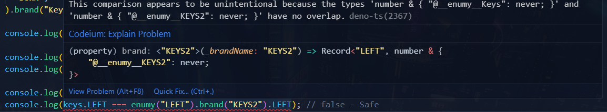

# enumy

Enhanced enum for TypeScript

- Installation

```bash
npx jsr add jsr:@evex/enumy
bunx jsr add jsr:@evex/enumy
deno add jsr:@evex/enumy
```

- Usage

```ts
import { enumy } from "jsr:@evex/enumy";

const keys = enumy(
  "LEFT",
  "RIGHT",
  "UP",
  "DOWN",
);

console.log(keys);

console.log(keys.LEFT === keys.LEFT); // true
console.log(keys.LEFT === keys.RIGHT); // false

console.log(keys.LEFT === 0); // false - Safe
console.log(keys.LEFT === enumy("LEFT").LEFT); // false - Safe

// details: example.ts

- Usage for TypeSafe
```

// BRANDED for TypeSafe enumy(...).brand("KEYS") enumy(...).brand("KEYS2")

```


- License MIT

- Author
  - EdamAmex
```
